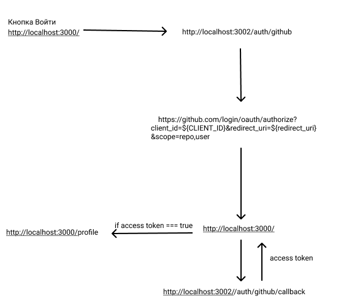

## Технологии

- React
- TypeScript
- Redux Toolkit
- React Router
- Tailwind CSS
- Express (Backend)
- GitHub API

## Установка и запуск

1. Клонировать репозиторий (надо будет открыть директорию терминала в пустой папке):
```bash
git clone https://github.com/daniarmakyev/githubOAuth.git .
npm install
npm start
```
## Откройте еще один терминал в нынешней директории
## ОБЯЗАТЕЛЬНО ОСВОБОДИТЕ ЛОКАЛЬНЫЙ 3002 ПОРТ
```bash
cd server
npm install
node index.js
```

## В текущей реализации проекта не реализованы все необходимые меры безопасности.
1. Перенести все запросы к GitHub API на бэкенд для предотвращения прямого доступа к токену на клиенте
2. Использовать шифрование access token на бэкенде
3. Реализовать state parameter (40-символьный случайный текст) при OAuth аутентификации
4. Добавить rate limiting для API запросов
7. Настроить secure headers (CORS)

## Как я реалозваол oAuth


забыл добавить что в конце при получении асcess токена мы отправляем code в квери парметрах который получили после аутефикации, также туда можно было пихнуть  state parameter для доп защиты
